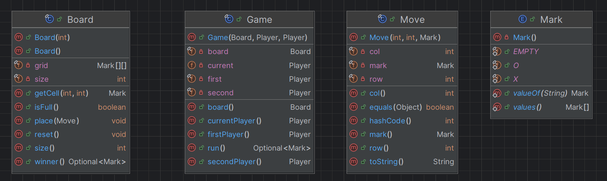
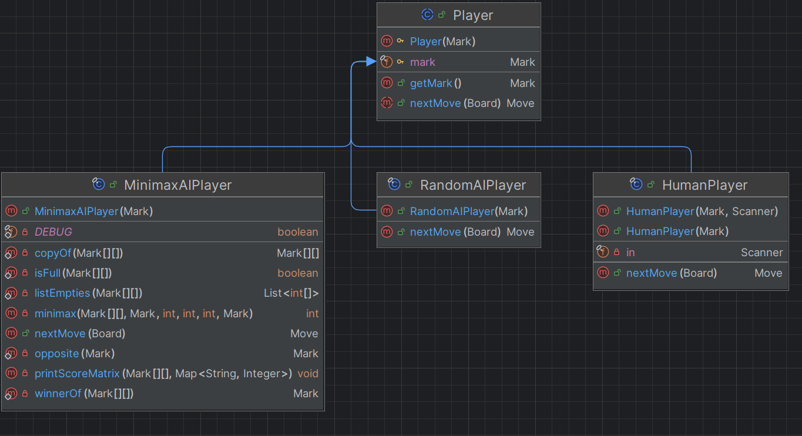
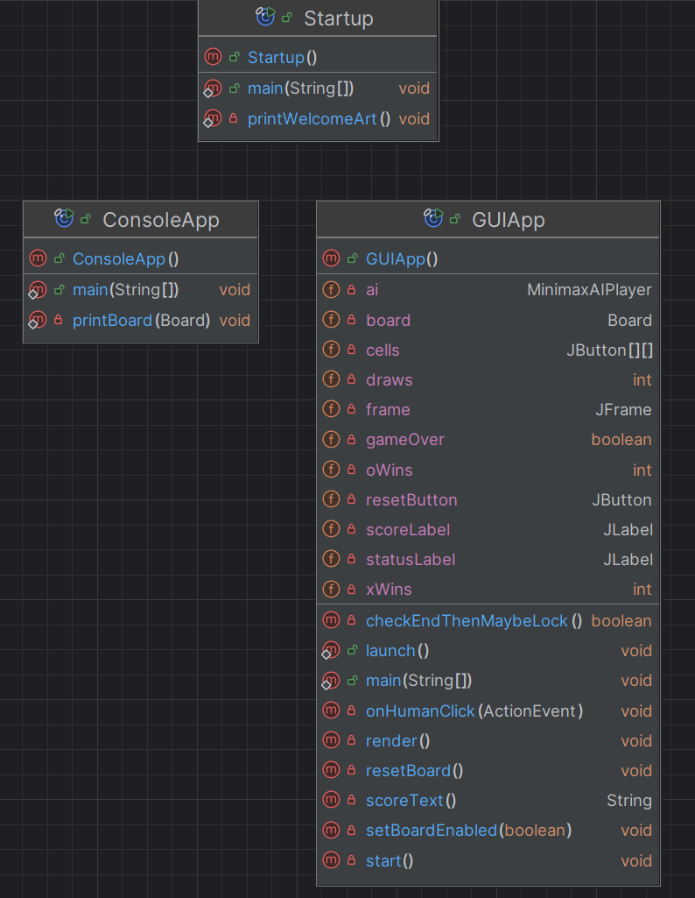
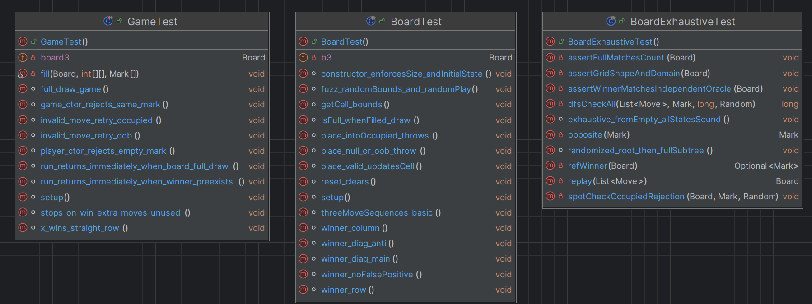

# Tic-Tac-Toe (Java, Encapsulation & Inheritance)

## Introduction
Assignment 1, CS3560.  
This project implements a simple **Tic-Tac-Toe game** in Java as a hands-on exercise in **encapsulation, inheritance, and polymorphism**.

The problem statement we address is:
> *Design and implement a Tic-Tac-Toe game in Java that not only works correctly but also demonstrates core object-oriented principles. Specifically, the project challenges us to:
Apply encapsulation to protect game state using private fields, invariants, and narrow interfaces.
Use inheritance and polymorphism to model interchangeable player types (e.g., Human vs. AI).
Separate concerns via the Model–View–Controller (MVC) pattern for testability and clarity.
Validate correctness through JUnit tests for the Board and Game classes.*

By solving this problem, we practice structuring an object-oriented Java project that is testable, extensible, and readable.

---
## How to Run
Compile and run Startup.java

---

## Solution Outline
The project is structured around the **Model-View-Controller (MVC)** pattern:

- **Model (game state & rules)**
    - `Mark` – enum for `X`, `O`, `EMPTY`.
    - `Move` – immutable record of a single move (`row`, `col`, `mark`).
    - `Board` – encapsulates the grid, enforces valid moves, checks for winner/draw.

- **Controller / Orchestrator**
    - `Game` – runs the game loop, alternating between players, checking rules after each move.

- **Players (Inheritance & Polymorphism)**
    - `Player` – abstract base class with `nextMove(Board)`.
    - `HumanPlayer` – asks the user for input via console.
    - `RandomAIPlayer` – picks a random empty cell.
    - `MinimaxAIPlayer` - uses the Minimax algorithm to try to beat a user.

- **View**
    - `Startup` - entry point of program.
    - `ConsoleApp` – handles text I/O and prints the board between moves.
    - `GUIApp` - handles graphical I/O and shows board between moves.

---

## Design Rational
This project is grounded in principles emphasized in CS4800: Software Engineering,
particularly the Model–View–Controller (MVC) architectural style and the SOLID principles of object-oriented design.

The overall goal was to build a Tic-Tac-Toe application with clean separation of concerns and well-defined interfaces,
such that each component exposes a simple API while hiding its implementation details.
By structuring the project this way, bugs were minimized via: every “worker” class carries out its own responsibility,
while the “orchestrator” (Game) coordinates the flow.
This modular design also made it straightforward to add variations
(e.g., Random AI vs. Minimax AI, CLI vs. GUI) without altering core logic.

**Single Responsibility Principle (SRP)**
  - `Board` - manages game state and rules.
  - `Player` - and its subclasses handle move selection.
  - `Game` - orchestrates turns and win/draw detection.
  - `ConsoleApp` / `GUIApp` - provide separate user interfaces.

**Interface Segregation Principle (ISP):**
Clients only depend on the functionality they actually use. For example, `Player` only exposes `nextMove(Board)` without
being dependent on a UI.

**Encapsulation and Abstraction**
Core data (like the 2D grid) is private. Interactions occur only through controlled methods such as `place()` `winner()` and `getCell()`.

---

## UML Diagram

**Core Classes**

**Player Class/Subclasses**

**UI Classes**

**Test Classes**

---

## Reflection
**Where did encapsulation prevent bugs?**  
Due to the nature of strict enforcement of the SOLID principles, there are instances where bugs should've appeared but didn't.
- `Board` -  hides the 2D array of the grid and only exposes it via the interface. As a result, no other part of the program could accidentally write to the grid (like UI) meaning no invalid operations could ever happen (such as OutOfBoundsException).
- `Move` -  is immutable and always validated. This means that we cant change the board layout after the game initiates.
- `winner() and isFUll()` -  is encapsulated in `Board`. This ensures that any game state changes (like "three in a row") is handles consistently. 

**Why inheritance here (vs. strategy/composition)?**  
Inheritance was chosen because it keeps things simple and shows off polymorphism clearly.
All players share the same base, `Player` and only differ in how they pick a move.
This makes the Game class clean since it just calls `nextMove()` no matter what type of player it is.
- `Player` -  holds the common piece of data (mark) and enforces it once.
- `HumanPlayer`, `RandomAIPlayer`, and `AIPlayerMinimax` each provide their own `nextMove()` implementation.
- Game doesn’t need to know which one it’s using — it just calls `nextMove()` and it works.

*Note: If the game got more complex (like wanting to switch AI strategies at runtime, add difficulty levels,
or combined features like “Minimax + Logging + Socket Programming”), then Strategy/Composition would be better;
But for this project, inheritance was enough.*

**What would you refactor if the rules changed to 4-in-a-row on a 5x5 board?**  
- Create a new constructor in board such as `new Board(int size, int winLength)` where `winLength` is how big we want the 
board size to be.
- Refactor `winner()` such that row/col check for `winLength` linear instances *(n in a row)*, and ensure main diagonals have `winLength` checks for `size = n`.

---

## Stretch Goals
- Implemented Minimax AI 
- Persistent Scores (GUI only)
- Created GUI 